# Plan: Addon Implementation

## Goal
Implement all 31 addons across shared and platform-specific directories following the Spec 003 standards.

## Phases

### Phase 1: Shared Addons (8 addons)
Platform-agnostic addons in `shared/addons/`.

| Addon | Scripts | Est. Time |
|-------|---------|-----------|
| cert-manager | install, uninstall, upgrade | 30 min |
| metrics-server | install, uninstall, upgrade | 20 min |
| ingress-nginx | install, uninstall, upgrade | 30 min |
| external-dns | install, uninstall, upgrade | 30 min |
| prometheus-stack | install, uninstall, upgrade | 45 min |
| argocd | install, uninstall, upgrade | 45 min |
| external-secrets | install, uninstall, upgrade | 30 min |
| keda | install, uninstall, upgrade | 30 min |

**Subtotal**: ~4 hours

---

### Phase 2: EKS Addons (8 addons)
AWS-specific addons requiring IRSA, EKS APIs, or AWS CLI.

| Addon | Scripts | Complexity |
|-------|---------|------------|
| aws-load-balancer-controller | install, uninstall, upgrade | High (IRSA) |
| cluster-autoscaler | install, uninstall, upgrade | Medium |
| karpenter | install, uninstall, upgrade | High (IAM, SQS) |
| aws-ebs-csi-driver | install, uninstall, upgrade | Medium (IRSA) |
| eks-pod-identity-agent | install, uninstall, upgrade | Medium |
| cloudwatch-observability | install, uninstall, upgrade | Medium |
| secrets-store-csi-driver | install, uninstall, upgrade | Medium |
| aws-efs-csi-driver | install, uninstall, upgrade | Medium (IRSA) |

**Subtotal**: ~5 hours

---

### Phase 3: GKE Addons (6 addons)
GCP-specific addons requiring Workload Identity, gcloud, or GKE APIs.

| Addon | Scripts | Complexity |
|-------|---------|------------|
| workload-identity ✅ | Already done | - |
| config-connector | install, uninstall, upgrade | High (IAM) |
| cloud-sql-proxy | install, uninstall, upgrade | Medium |
| filestore-csi | install, uninstall, upgrade | Medium |
| cloud-armor | install, uninstall, upgrade | Medium |
| anthos-service-mesh | install, uninstall, upgrade | High |

**Subtotal**: ~3 hours (5 remaining)

---

### Phase 4: AKS Addons (6 addons)
Azure-specific addons requiring AAD, az CLI, or AKS APIs.

| Addon | Scripts | Complexity |
|-------|---------|------------|
| appgw-ingress ✅ | Already done | - |
| keyvault-csi ✅ | Already done | - |
| aad-pod-identity | install, uninstall, upgrade | High (AAD) |
| azure-disk-csi | install, uninstall, upgrade | Medium |
| azure-file-csi | install, uninstall, upgrade | Medium |
| azure-policy | install, uninstall, upgrade | Medium |

**Subtotal**: ~2 hours (4 remaining)

---

### Phase 5: Kind Addons (3 addons)
Local development addons.

| Addon | Scripts | Complexity |
|-------|---------|------------|
| local-path-provisioner | install, uninstall, upgrade | Low |
| metallb | install, uninstall, upgrade | Medium |
| registry | install, uninstall, upgrade | Low |

**Subtotal**: ~1 hour

---

## Implementation Order

```mermaid
gantt
    title Addon Implementation Timeline
    dateFormat  HH:mm
    axisFormat %H:%M
    
    section Shared
    cert-manager           :a1, 00:00, 30m
    metrics-server         :a2, after a1, 20m
    ingress-nginx          :a3, after a2, 30m
    external-dns           :a4, after a3, 30m
    prometheus-stack       :a5, after a4, 45m
    argocd                 :a6, after a5, 45m
    external-secrets       :a7, after a6, 30m
    keda                   :a8, after a7, 30m
    
    section EKS
    aws-load-balancer      :b1, after a8, 45m
    cluster-autoscaler     :b2, after b1, 30m
    karpenter              :b3, after b2, 45m
    aws-ebs-csi            :b4, after b3, 30m
    eks-pod-identity       :b5, after b4, 30m
    cloudwatch-obs         :b6, after b5, 30m
    secrets-store-csi      :b7, after b6, 30m
    aws-efs-csi            :b8, after b7, 30m
    
    section GKE
    config-connector       :c1, after b8, 45m
    cloud-sql-proxy        :c2, after c1, 30m
    filestore-csi          :c3, after c2, 30m
    cloud-armor            :c4, after c3, 30m
    anthos-service-mesh    :c5, after c4, 45m
    
    section AKS
    aad-pod-identity       :d1, after c5, 45m
    azure-disk-csi         :d2, after d1, 30m
    azure-file-csi         :d3, after d2, 30m
    azure-policy           :d4, after d3, 30m
    
    section Kind
    local-path-provisioner :e1, after d4, 20m
    metallb                :e2, after e1, 30m
    registry               :e3, after e2, 20m
```



---

## Total Effort

| Phase | Addons | New | Hours |
|-------|--------|-----|-------|
| Shared | 8 | 8 | 4 |
| EKS | 8 | 8 | 5 |
| GKE | 6 | 5 | 3 |
| AKS | 6 | 4 | 2 |
| Kind | 3 | 3 | 1 |
| **Total** | **31** | **28** | **~15 hours** |

---

## Dependencies

### External Tools Required
- `helm` v3.x
- `kubectl` v1.28+
- `aws` CLI (for EKS)
- `gcloud` CLI (for GKE)
- `az` CLI (for AKS)

### Helm Repositories
```bash
helm repo add jetstack https://charts.jetstack.io
helm repo add metrics-server https://kubernetes-sigs.github.io/metrics-server/
helm repo add ingress-nginx https://kubernetes.github.io/ingress-nginx
helm repo add external-dns https://kubernetes-sigs.github.io/external-dns/
helm repo add prometheus-community https://prometheus-community.github.io/helm-charts
helm repo add argo https://argoproj.github.io/argo-helm
helm repo add external-secrets https://charts.external-secrets.io
helm repo add kedacore https://kedacore.github.io/charts
```

---

## Success Criteria

- [ ] All 31 addons have `install.sh`, `uninstall.sh`, `upgrade.sh`
- [ ] All scripts pass `--help` validation
- [ ] All scripts are idempotent (safe to re-run)
- [ ] README.md exists for each addon
- [ ] Shared addons work on Kind for local testing
