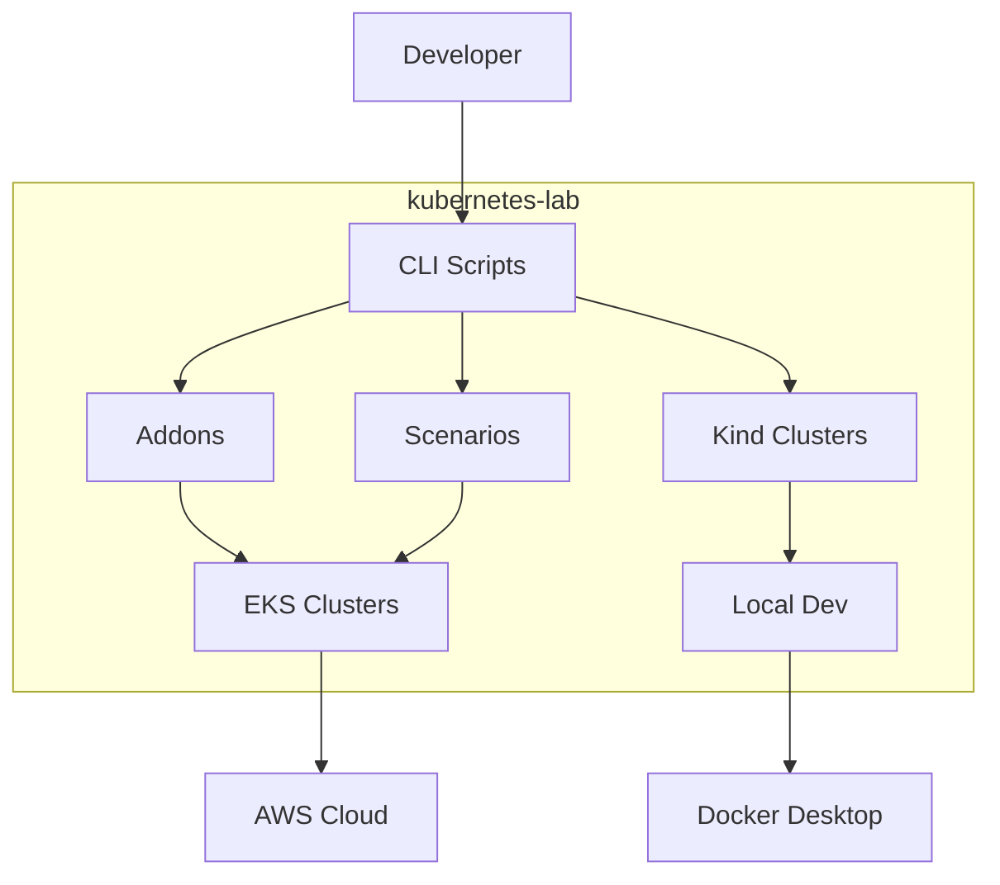
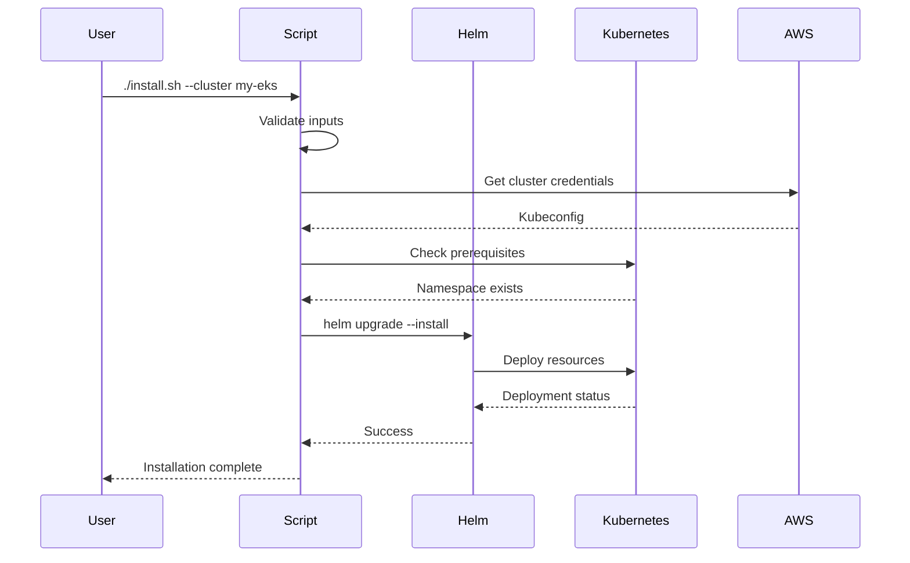

# Architecture Overview

This document describes the high-level architecture of kubernetes-lab.

## System Context



## Component Architecture

### Core Components

| Component | Purpose | Location |
|-----------|---------|----------|
| **EKS Addons** | Kubernetes addon installers | `eks/addons/` |
| **EKS Scenarios** | Integration workflows | `eks/scenarios/` |
| **Kind** | Local cluster management | `kind/` |
| **Shared** | Common utilities | `shared/` |
| **Tests** | Test suites | `tests/` |

### Directory Structure

```
kubernetes-lab/
├── eks/
│   ├── addons/           # Individual addon installers
│   │   ├── ingress-nginx/
│   │   ├── cert-manager/
│   │   └── ...
│   └── scenarios/        # Multi-addon workflows
│       ├── api-gateway/
│       └── ...
├── kind/                 # Local Kind cluster configs
├── shared/               # Shared utilities and libraries
│   ├── lib/              # Bash libraries
│   └── config/           # Common configurations
├── tests/                # Test suites
├── docs/                 # Documentation
└── scripts/              # Development scripts
```

## Addon Architecture

Each addon follows a consistent structure:

```
addons/<addon-name>/
├── install.sh            # Main installer (CLI 12-factor)
├── uninstall.sh          # Uninstaller
├── values/               # Helm values
│   ├── default.yaml
│   └── production.yaml
├── manifests/            # Raw K8s manifests (if not Helm)
├── README.md             # Addon documentation
└── tests/                # Addon-specific tests
```

### CLI 12-Factor Compliance

All scripts follow [CLI 12-Factor principles](https://12factor.net/):

```bash
# Every script supports:
./install.sh --help       # Usage information
./install.sh --version    # Version information
./install.sh --dry-run    # Preview changes
./install.sh --verbose    # Detailed output
```

## Data Flow



## Deployment Patterns

### Pattern 1: Single Addon

```bash
./eks/addons/ingress-nginx/install.sh \
  --cluster my-eks \
  --namespace ingress-nginx
```

### Pattern 2: Scenario (Multiple Addons)

```bash
./eks/scenarios/api-gateway/deploy.sh \
  --cluster my-eks \
  --dry-run
```

Deploys: ingress-nginx, cert-manager, external-dns in correct order.

### Pattern 3: Local Development

```bash
# Create local cluster
./kind/create-cluster.sh --name dev

# Install addons locally
./eks/addons/ingress-nginx/install.sh --cluster kind-dev
```

## Cross-Cutting Concerns

### Logging

All scripts use consistent logging:

```bash
[INFO]  Starting installation...
[WARN]  No values file specified, using defaults
[ERROR] Cluster not found: my-eks
[OK]    Installation complete
```

### Error Handling

```bash
set -euo pipefail
trap cleanup EXIT
```

### Configuration Management

```
Priority (high to low):
1. Command-line flags
2. Environment variables
3. Config files
4. Default values
```

## Integration Points

| System | Integration | Method |
|--------|-------------|--------|
| AWS EKS | Cluster management | aws-cli, eksctl |
| Helm | Package management | helm CLI |
| kubectl | K8s operations | kubectl CLI |
| Kind | Local clusters | kind CLI |

## Security Considerations

- No credentials stored in code
- RBAC follows least privilege
- Secrets via external-secrets or KMS
- Network policies enabled by default
- Pod security standards enforced

---

*Last updated: 2026-01-31*
